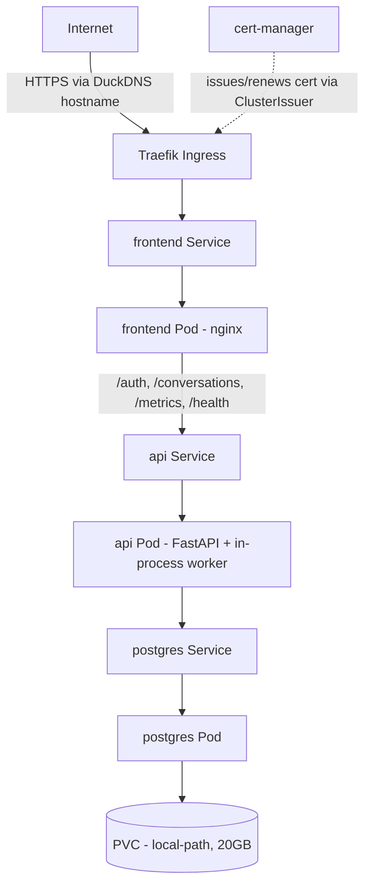

# Deployment Architecture — Unit 6: Packaging & Deployment

## Local (Docker Compose) — US-6.1

Single command: `docker compose up`. All three services on one Docker network, ports published to `localhost` for local access.

## Cloud (k3s on Oracle Cloud) — US-6.2

Single Oracle Cloud Ampere A1 VM (`ap-mumbai-1`, 4 OCPU/24GB, Ubuntu 22.04 ARM) running k3s. Traefik (bundled with k3s) is the single ingress point — it forwards **all** traffic to the `frontend` Service; the frontend's own nginx does the internal split to the `api` Service by real path prefix (same config as the Compose target, no routing logic duplicated in the Ingress). TLS is terminated at Traefik with a cert-manager-issued Let's Encrypt certificate for the DuckDNS hostname, which resolves to the VM's reserved static public IP. All app Pods run single-replica; Postgres persists via a `local-path` PVC on the VM's own disk.

## Deploy flow (manual, no CI/CD)

1. `docker build` images for `api` and `frontend` directly on the VM (no registry — see NFR Requirements Q2).
2. `kubectl apply -f k8s/` (namespace, Deployments, Services, Ingress, ClusterIssuer, Secret).
3. For updates: rebuild the changed image on the VM, `kubectl rollout restart deployment/<name>`.

Documented step-by-step in the README per US-6.2's acceptance criteria.
