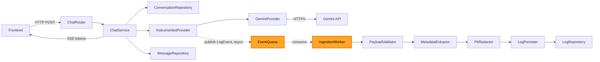

# Component Dependencies

## Dependency Matrix

| Component | Depends On | Communication |
|---|---|---|
| `ChatService` | `ConversationRepository`, `MessageRepository`, `InstrumentedProvider` | Direct in-process calls |
| `InstrumentedProvider` | wrapped `LLMProvider` (e.g. `GeminiProvider`), `EventQueue` | Direct call (delegation) + async publish |
| `GeminiProvider` | Gemini API (external) | HTTPS |
| `IngestionWorker` | `EventQueue` (consume), `PayloadValidator`, `MetadataExtractor`, `PIIRedactor`, `LogPersister` | Async consume loop, sequential in-process calls |
| `LogPersister` | `LogRepository` | Direct in-process call |
| `AnalyticsService` | `LogRepository` | Direct in-process call (read) |
| `AuthService` | `UserRepository` | Direct in-process call |
| `ChatRouter` / `ConversationRouter` | `ChatService`, `AuthService` | Direct in-process call |
| `DashboardRouter` | `AnalyticsService`, `AuthService` | Direct in-process call |
| `AuthRouter` | `AuthService` | Direct in-process call |
| Frontend (React SPA) | All API routers | HTTP (JSON) + SSE (streaming) |

## Communication Patterns

- **Synchronous, in-process**: `ChatService` ↔ repositories, `AuthService` ↔ `UserRepository`, `AnalyticsService` ↔ `LogRepository`. All ordinary method calls within the same process.
- **Synchronous, external**: `GeminiProvider` ↔ Gemini API over HTTPS.
- **Asynchronous, decoupled**: `InstrumentedProvider` → `EventQueue` → `IngestionWorker`. This is the one genuinely async boundary in the system — the producer (`InstrumentedProvider`, invoked from within `ChatService`'s call path) never waits on the consumer (`IngestionWorker`).
- **Streaming**: API layer → Frontend, via SSE, for token-by-token chat responses.

## Data Flow — Chat Request with Logging



### Text Alternative
```
Frontend -> ChatRouter -> ChatService
ChatService -> ConversationRepository (load/update conversation)
ChatService -> InstrumentedProvider -> GeminiProvider -> Gemini API (external)
InstrumentedProvider -> EventQueue (publish, non-blocking, async)
ChatService -> Frontend (SSE token stream)
ChatService -> MessageRepository (persist final message, synchronous)

EventQueue -> IngestionWorker (consume, async, decoupled from the above)
IngestionWorker -> PayloadValidator -> MetadataExtractor -> PIIRedactor -> LogPersister -> LogRepository
```

## Key Design Property

The chat request path (top row) and the ingestion path (bottom row) share exactly one connection point — the `EventQueue` publish call — and that call is non-blocking. This is what makes US-3.1 ("non-blocking log ingestion") structurally true rather than just an aspiration: there is no code path by which `IngestionWorker` slowness can propagate back to `ChatService`.
