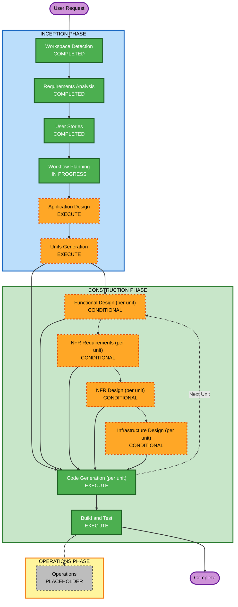

# Execution Plan

## Detailed Analysis Summary

### Change Impact Assessment
- **User-facing changes**: Yes — chat interface, streaming, cancel/list/resume, dashboard.
- **Structural changes**: Yes — this is the initial architecture for the whole system (greenfield).
- **Data model changes**: Yes — new schema for users, conversations, messages, inference logs, extracted metadata.
- **API changes**: Yes — all endpoints are new (chat, streaming, conversation management, dashboard queries, ingestion).
- **NFR impact**: Yes — non-blocking async logging (performance), PII redaction + session auth + isolation (security), swappable broker (scalability/extensibility), poll-based metrics (observability).

### Application Layer Impact
- New entry points: chat API, SSE streaming endpoint, conversation list/resume/cancel endpoints, dashboard query endpoints.
- New adapters: LLM provider adapter (Gemini), event queue adapter (in-process, swap-ready for Redis Streams).
- New configuration: LLM API key, DB connection string, session secret.
- New testing: unit tests (redaction, context truncation, aggregation queries), integration tests (SDK → queue → worker → DB path, isolation checks).

### Infrastructure Layer Impact
- Deployment model: Docker Compose for local dev; Kubernetes manifests for a real cloud cluster (provider TBD — resolved in Infrastructure Design for the deployment unit).
- Networking: ingress/service exposure for the k8s deployment; no special networking needed for Compose.
- Storage: PostgreSQL with a persistent volume in both Compose and k8s.
- Scaling: not a hard requirement at this stage (single-instance is acceptable for a demo), but the queue-interface and provider-interface abstractions are explicitly designed to not block future scaling.

### Operations Layer Impact
- Monitoring: the dashboard itself (latency/throughput/errors) is the monitoring surface — no external monitoring stack (Resiliency Baseline was declined).
- Logging: structured inference logs are the core deliverable, not incidental.
- Alerting: out of scope (Resiliency Baseline declined; no alerting requirement in requirements.md).
- Deployment: Compose for local, k8s manifests + README deployment steps for cloud.

### Risk Assessment
- **Risk Level**: Medium — multiple integrated components and an unresolved cloud-provider choice, but this is a new build with no production system to break, so rollback risk is low by nature.
- **Rollback Complexity**: Easy (greenfield — nothing in production yet).
- **Testing Complexity**: Moderate (concurrency in the ingestion pipeline and multi-tenant isolation both need deliberate test coverage, not just happy-path checks).

## Workflow Visualization



### Text Alternative

```
INCEPTION PHASE
- Workspace Detection: COMPLETED
- Requirements Analysis: COMPLETED
- User Stories: COMPLETED
- Workflow Planning: IN PROGRESS (this stage)
- Application Design: EXECUTE
- Units Generation: EXECUTE

CONSTRUCTION PHASE (per unit, after Units Generation produces the unit list)
- Functional Design: CONDITIONAL, assessed per unit
- NFR Requirements: CONDITIONAL, assessed per unit
- NFR Design: CONDITIONAL, assessed per unit
- Infrastructure Design: CONDITIONAL, assessed per unit
- Code Generation: EXECUTE, always, per unit
- Build and Test: EXECUTE, always, after all units complete

OPERATIONS PHASE
- Operations: PLACEHOLDER
```

## Phases to Execute

### INCEPTION PHASE
- [x] Workspace Detection (COMPLETED)
- [x] Requirements Analysis (COMPLETED)
- [x] User Stories (COMPLETED)
- [x] Workflow Planning (IN PROGRESS)
- [ ] Application Design — **EXECUTE**
  - **Rationale**: Multiple new components/services are needed (chatbot API, SDK, ingestion worker, dashboard API, frontend) with real dependencies between them (SDK depends on the provider interface; ingestion worker depends on the queue interface; dashboard depends on the ingestion pipeline's output). Component boundaries, methods, and dependencies need to be defined before decomposing into units.
- [ ] Units Generation — **EXECUTE**
  - **Rationale**: New data models, new API endpoints, complex concurrency (producer-consumer ingestion), state management (conversation lifecycle), and a confirmed multi-phase delivery sequence all indicate this needs structured decomposition into units of work rather than being treated as one monolithic implementation pass.

### CONSTRUCTION PHASE
- [ ] Functional Design (per unit) — **CONDITIONAL**, assessed per unit when Units Generation produces the unit list. Expected to execute for units with new data models or non-trivial business logic (e.g. ingestion pipeline, conversation lifecycle) and likely skip for thin units.
- [ ] NFR Requirements (per unit) — **CONDITIONAL**, assessed per unit. Expected to execute for units with explicit NFRs already identified in requirements.md (non-blocking logging, isolation, extensibility).
- [ ] NFR Design (per unit) — **CONDITIONAL**, follows NFR Requirements per unit.
- [ ] Infrastructure Design (per unit) — **CONDITIONAL**, expected to execute specifically for the deployment unit (Docker Compose + k8s), likely skip for others.
- [ ] Code Generation (per unit) — **EXECUTE (ALWAYS)**
  - **Rationale**: Implementation planning and code generation needed for every unit.
- [ ] Build and Test — **EXECUTE (ALWAYS)**
  - **Rationale**: Build, test, and verification needed once all units are complete.

### OPERATIONS PHASE
- [ ] Operations — **PLACEHOLDER**
  - **Rationale**: Future deployment/monitoring workflow expansion; not part of current AI-DLC scope.

## Estimated Timeline
- **Total Phases**: 2 active phases (Inception, Construction) across an estimated 6 units of work (per the confirmed delivery sequence / story epics).
- **Estimated Duration**: Not time-boxed — paced by review at each gate rather than a fixed schedule, consistent with this being a portfolio-quality submission rather than a timed sprint.

## Success Criteria
- **Primary Goal**: A working, demoable LLM inference logging/ingestion system covering all core deliverables and all listed bonus items (multi-provider-ready, streaming, dashboards, Docker Compose, event-based architecture, PII redaction, cloud k8s deployment, frontend lifecycle controls).
- **Key Deliverables**: GitHub repository, README (setup, architecture, schema decisions, tradeoffs, future improvements), Architecture Notes (ingestion flow, logging strategy, scaling considerations, failure handling assumptions), demo (live link and/or screenshots/video).
- **Quality Gates**: Every story's acceptance criteria satisfied; schema design defensible and documented; isolation guarantee (US-5.4) actually verified, not assumed.
